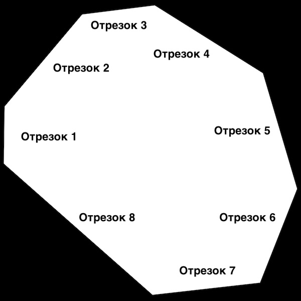

### Калькулятор подсчёта количества и стоимости материалов, для строительства забора частного домовладения из профлиста.

Данный калькулятор предназначен для автоматического подсчёта необходимых материалов для строительства ограждения
(забора) честного домовладения, по заданным параметрам.

#### Как пользоваться:

1. Запустите калькулятор в среде Python;
2. На первом шаге программа задаст вопрос, будет ли Ваш забор иметь замкнутый контур?  
На данный момент этот функционал не задействован. Можно просто нажать `Enter`
3. На втором шаге программа попросит выбрать марку профнастила из представленного списка.  
Выберите нужный вам профлист (Подробнее о марках профнастила можно почитать здесь: https://srbu.ru/stroitelnye-materialy/397-kakoj-proflist-luchshe-dlya-zabora.html)
4. На третьем шаге программа запросит желаемую высоту забора.  
Выберите необходимую Вам высоту ограждения, обычно она составляет 1.8, 2.0 и 2.2 метра.
5. На четвёртом шаге программа запросит количество отрезков ограждения.  
Количество отрезков ограждения - это количество прямы отрезков забора, от одной точки перелома до другой.
Смотрите пояснения на рисунке ниже:  

Как видно из рисунка, земельный участок может быть не всегда правильной формы.
6. На последнем шаге, программа попросит указать в рублях стоимость одного листа профнастила.  
Укажите стоимость профнастила в магазине, в котором Вы собираетесь его приобрести.

### P.S.

 Это учебный проект, так что прошу сильно строго не судить &#58;&#41;

 В дальнейшем, при получении новых знаний и навыков, данный калькулятор планирую неустанно развивать.  
 Если есть желающие поэкспериментировать вместе, милости прошу и жду Ваши пул-реквесты &#58;&#41;

